# OpenMark

[](https://opensource.org/licenses/MIT)
[](https://www.python.org/downloads/)
[](https://flask.palletsprojects.com/)
[](https://hub.docker.com/r/gluk46546546/openmark)

**OpenMark** is a comprehensive PDF visualization solution with annotation capabilities, designed for enterprise integration. It enables your applications to display PDF documents with virtual sticky notes and text highlighting features through a simple REST API.


## 🌟 Features

- 📄 **PDF Visualization** - View PDF documents directly in the browser
- 📝 **Sticky Notes** - Create, edit, and delete virtual post-it notes on specific document areas
- 🖍️ **Text Highlighting** - Highlight text zones with customizable colors
- 🔐 **Secure Authentication** - JWT-based authentication with multiple backends
- 📊 **Usage Statistics** - Track document views, notes, and highlights usage
- 📜 **History Tracking** - View consultation history with timestamps and IP addresses
- 🔌 **Plugin System** - Extensible architecture for authentication, PDF sources, and storage
- 🌐 **Cross-Domain Support** - Embed the viewer in iframes from any domain

## 📚 Documentation

| Document                                                       | Description                                                    |
| -------------------------------------------------------------- | -------------------------------------------------------------- |
| [Architecture](docs/architecture.md)                           | System architecture, integration flow, and JWT token structure |
| [Installation](docs/installation.md)                           | Installation guide for development and production              |
| [Configuration](docs/configuration.md)                         | Configuration options and examples                             |
| [API Reference](docs/api_usage.md)                             | Complete REST API documentation                                |
| [Plugin Development](docs/developing_plugins.md)               | Guide for creating custom plugins                              |
| [Plugin Configurations](docs/default_plugin_configurations.md) | Configuration for all built-in plugins                         |
| [Scripts Administration](docs/scripts_administration.md)       | CLI scripts for user and annotation management                 |
| [Annotations Import/Export](docs/annotations_import.md)        | Import and export annotations via CLI                          |
| [Testing](docs/testing.md)                                     | Automated testing guide with pytest                            |

## 🏗️ Architecture Overview

```mermaid
graph LR
    subgraph "Your Application"
        CLIENT[👤 Client Browser]
        SERVER[🖥️ Your Server]
    end

    subgraph "OpenMark"
        OM[📄 OpenMark<br/>Docker Container]
    end

    subgraph "Storage"
        PDF[(📁 PDF Repository)]
        DB[(💾 Database)]
    end

    SERVER -->|1. POST /api/quickView| OM
    OM -->|2. Return DAT + viewUrl| SERVER
    SERVER -->|3. Send viewer URL| CLIENT
    CLIENT -->|4. Load viewer| OM
    OM -->|5. Fetch PDF| PDF
    OM -->|6. Load/Save annotations| DB

    style CLIENT fill:#e1f5fe
    style SERVER fill:#fff3e0
    style OM fill:#e8f5e9
    style PDF fill:#fce4ec
    style DB fill:#f3e5f5
```



**Integration Flow:**

1. Your server authenticates with OpenMark and requests document access
2. OpenMark returns a JWT-based Document Access Token (DAT) and viewer URL
3. Your server sends the viewer URL to the client application
4. Client loads the PDF viewer (supports iframe embedding)
5. OpenMark fetches PDF from configured source and manages annotations

## 🚀 Quick Start

### Using Docker (Recommended)

```bash
# Pull the official image
docker pull gluk46546546/openmark:latest

# Run with default configuration
docker run -d -p 5000:5000 gluk46546546/openmark:latest

# Or with custom configuration
docker run -d -p 5000:5000 \
  -v ./config.json:/app/config.json:ro \
  gluk46546546/openmark:latest
```

### Using Docker Compose

```yaml
version: "3.8"
services:
  openmark:
    image: gluk46546546/openmark:latest
    ports:
      - "5000:5000"
    volumes:
      - ./config.json:/app/config.json:ro
      - ./data:/app/data
```

```bash
cd dev
docker-compose up -d
```

For detailed installation instructions, see [Installation Guide](docs/installation.md).

## 🔌 Built-in Plugins

### Authentication Plugins

| Plugin         | Description                                                          |
| -------------- | -------------------------------------------------------------------- |
| **Local**      | JSON file-based authentication for development and small deployments |
| **MongoDB**    | Scalable authentication with MongoDB for multi-instance deployments  |
| **PostgreSQL** | ACID-compliant authentication with PostgreSQL                        |
| **OAuth 2.0**  | Integrate with Google, GitHub, Microsoft, or custom OAuth providers  |
| **SAML SSO**   | Enterprise Single Sign-On with SAML 2.0 Identity Providers           |

### PDF Source Plugins

| Plugin               | Description                                                        |
| -------------------- | ------------------------------------------------------------------ |
| **HTTP/HTTPS**       | Retrieve PDFs from any HTTP endpoint                               |
| **AWS S3**           | Retrieve PDFs from S3 buckets (also works with MinIO, LocalStack)  |
| **Local Filesystem** | Retrieve PDFs from local directories or mounted volumes            |
| **WebDAV**           | Retrieve PDFs from Nextcloud, ownCloud, or any WebDAV server       |
| **FTP/FTPS**         | Retrieve PDFs from FTP servers with optional TLS encryption        |
| **SFTP**             | Retrieve PDFs over SSH from any Linux/Unix server                  |
| **CMIS**             | Retrieve PDFs from ECM systems (Alfresco, Nuxeo, SharePoint, etc.) |

### Annotations Plugins

| Plugin         | Description                                    |
| -------------- | ---------------------------------------------- |
| **Local**      | JSON file storage (development only)           |
| **MongoDB**    | Scalable annotation storage with MongoDB       |
| **PostgreSQL** | JSONB-based annotation storage with PostgreSQL |

For plugin configuration details, see [Plugin Configurations](docs/default_plugin_configurations.md).

## 🔧 Basic Configuration

Create a `config.json` file:

```json
{
  "server": {
    "host": "0.0.0.0",
    "port": 5000,
    "secret_key": "your-secret-key-min-32-characters"
  },
  "plugins": {
    "authentication": {
      "type": "local",
      "config": { "users_file": "./data/users.json" }
    },
    "pdf_source": {
      "type": "http",
      "config": { "base_url": "https://your-pdf-server.com/" }
    },
    "annotations": {
      "type": "local",
      "config": { "storage_path": "./data/annotations.json" }
    }
  }
}
```

For detailed configuration options, see [Configuration Guide](docs/configuration.md).

## 📖 API Usage Example

```python
import requests

OPENMARK_URL = "https://your-openmark-server.com"

# One-step authentication and document request
response = requests.post(f"{OPENMARK_URL}/api/quickView", json={
    "username": "user",
    "password": "password",
    "documentId": "invoice_001"
})

data = response.json()
viewer_url = OPENMARK_URL + data["viewUrl"]

# Send this URL to your client application
# The viewer URL contains a JWT token valid for 2 hours
print(f"Open in browser or iframe: {viewer_url}")
```

For complete API documentation, see [API Reference](docs/api_usage.md).

## 🤝 Contributing

1. Fork the repository
2. Create your feature branch (`git checkout -b feature/amazing-feature`)
3. Commit your changes (`git commit -m 'Add amazing feature'`)
4. Push to the branch (`git push origin feature/amazing-feature`)
5. Open a Pull Request

## 📄 License

This project is licensed under the MIT License - see the [LICENSE](LICENSE) file for details.

## 🔗 Links

- **GitHub Repository**: [https://github.com/gLUK00/OpenMark](https://github.com/gLUK00/OpenMark)
- **Docker Hub**: [https://hub.docker.com/r/gluk46546546/openmark](https://hub.docker.com/r/gluk46546546/openmark)

## 💬 Support

For support, please open an issue on [GitHub](https://github.com/gLUK00/OpenMark/issues).
