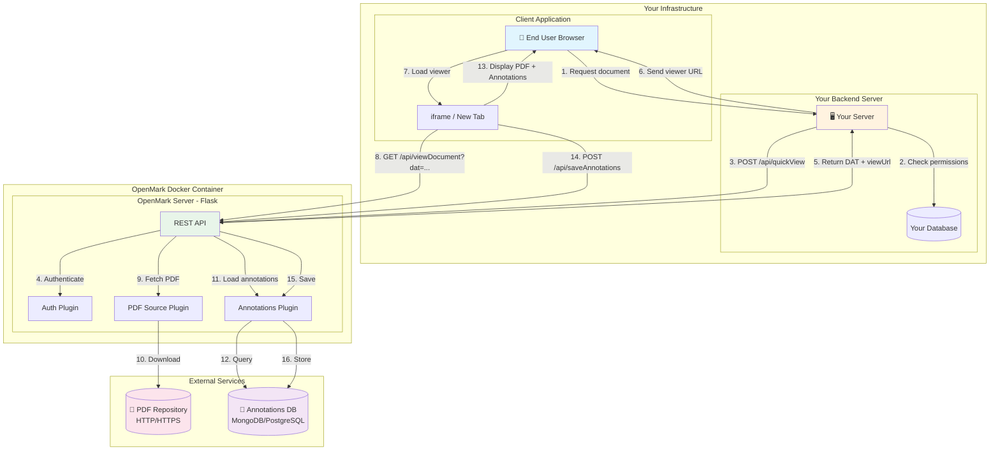
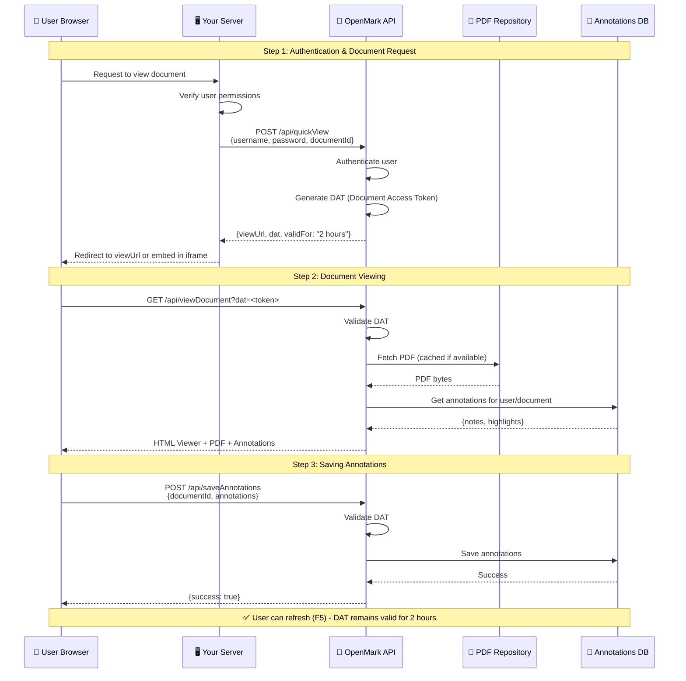
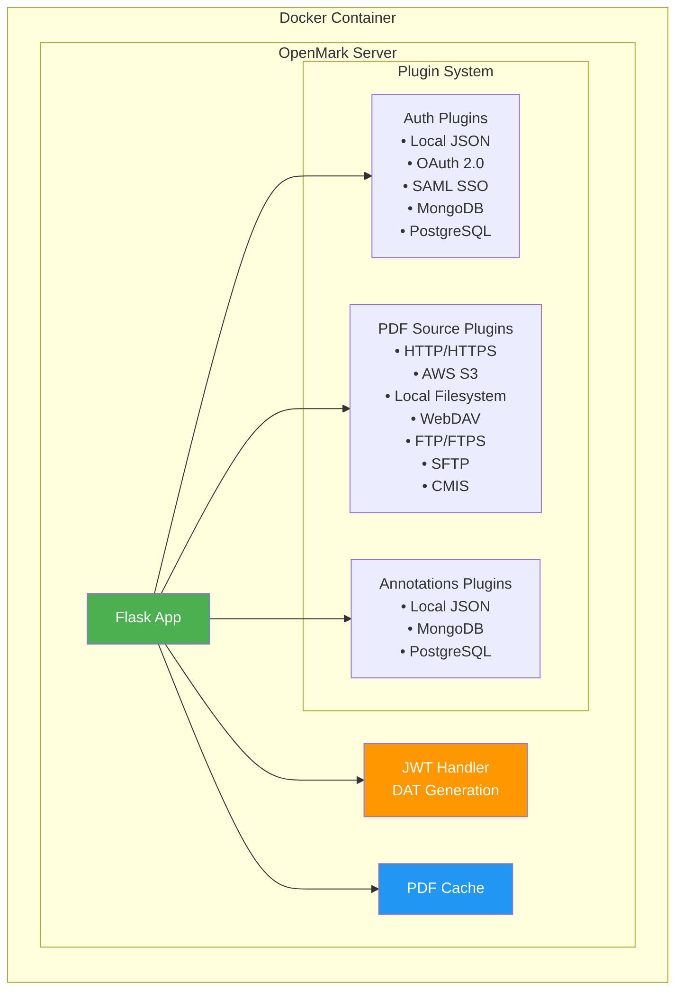
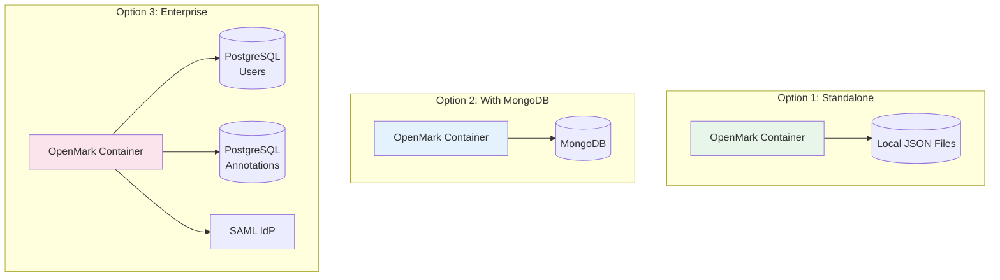
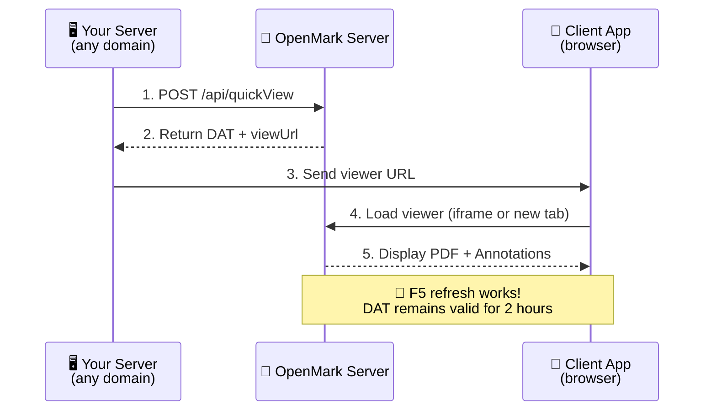

# OpenMark Architecture

This document describes the architecture of OpenMark and how it integrates with your existing infrastructure.

## Integration Overview

OpenMark is designed to be integrated into your existing infrastructure. Your backend server handles user authentication and document access control, then delegates PDF viewing to OpenMark.



## Detailed Integration Flow



## Component Architecture



## Deployment Options



## JWT Token Architecture

OpenMark uses JWT (JSON Web Tokens) for all authentication and authorization:

### Token Types

| Token Type | Purpose | Lifetime | Usage |
|------------|---------|----------|-------|
| **AT (Authentication Token)** | API authentication after login | Configurable (default: 24h) | `Authorization: Bearer <token>` header |
| **DAT (Document Access Token)** | Document viewing access | 4× cache duration (min 2h) | URL parameter `?dat=<token>` |

### Authentication Token (AT) Structure

```
┌─────────────────────────────────────────────────────────────────┐
│                    Authentication Token (AT)                     │
├─────────────────────────────────────────────────────────────────┤
│  Header:    { "alg": "HS256", "typ": "JWT" }                    │
│  Payload:   {                                                   │
│               "sub": "username",         // User identifier     │
│               "role": "admin",           // User role           │
│               "type": "at",              // Token type          │
│               "iat": 1736262000,         // Issued at           │
│               "exp": 1736348400,         // Expiration          │
│               "nbf": 1736262000          // Not before          │
│             }                                                   │
│  Signature: HMACSHA256(header + payload, SECRET_KEY)            │
└─────────────────────────────────────────────────────────────────┘
```

### Document Access Token (DAT) Structure

```
┌─────────────────────────────────────────────────────────────────┐
│                    Document Access Token (DAT)                  │
├─────────────────────────────────────────────────────────────────┤
│  Header:    { "alg": "HS256", "typ": "JWT" }                    │
│  Payload:   {                                                   │
│               "tid": "temp_abc123",      // Temp Document ID    │
│               "did": "invoice_001",      // Document ID         │
│               "sub": "username",         // User                │
│               "hat": false,              // hideAnnotationsTools│
│               "ha": false,               // hideAnnotations     │
│               "hl": true,                // hideLogo            │
│               "exp": 1736265600,         // Expiration          │
│               "type": "dat"              // Token type          │
│             }                                                   │
│  Signature: HMACSHA256(header + payload, SECRET_KEY)            │
└─────────────────────────────────────────────────────────────────┘
```

### Benefits of JWT Architecture

| Feature | Description |
|---------|-------------|
| **Stateless** | Tokens are self-contained, no server-side session storage required |
| **Page refresh (F5)** | DAT survives browser refresh |
| **Scalability** | Works seamlessly with load balancers and multiple instances |
| **Token revocation** | Supported via blacklist (in-memory, MongoDB, or PostgreSQL) |
| **Single URL parameter** | DAT contains all permissions, no multiple query params needed |
| **Shareable URLs** | Document URLs with DAT can be shared (within validity period) |

### How Authentication Works

```
1. User authenticates          → AT (Authentication Token) returned
2. Request document access     → DAT generated (2-hour minimum validity)
3. View document with DAT      → No AT needed for viewing
4. Page refresh (F5)           → DAT still valid ✅
5. Save annotations            → DAT authenticates the request
6. Logout                      → AT revoked via blacklist
```

## Cross-Domain and iframe Embedding

OpenMark supports cross-domain usage and iframe embedding, which is essential when:
- The authentication server is on a different domain
- The PDF viewer needs to be embedded in an external application
- Client applications display the viewer in an iframe

### Typical Integration Flow



> **Document Access Token (DAT)** is a self-contained JWT that survives page refreshes. No need to re-authenticate after F5!

### Example: Embedding in iframe

```html
<!-- On your external application -->
<!-- Using DAT (JWT Document Access Token) -->
<iframe 
  src="https://openmark-server.com/api/viewDocument?dat=eyJhbGciOiJIUzI1NiIsInR5cCI6IkpXVCJ9..."
  width="100%" 
  height="800"
  frameborder="0"
  allow="fullscreen">
</iframe>
```

> **Note:** All authentication uses JWT tokens. The DAT (Document Access Token) is a self-contained JWT that includes user permissions and document access rights.
